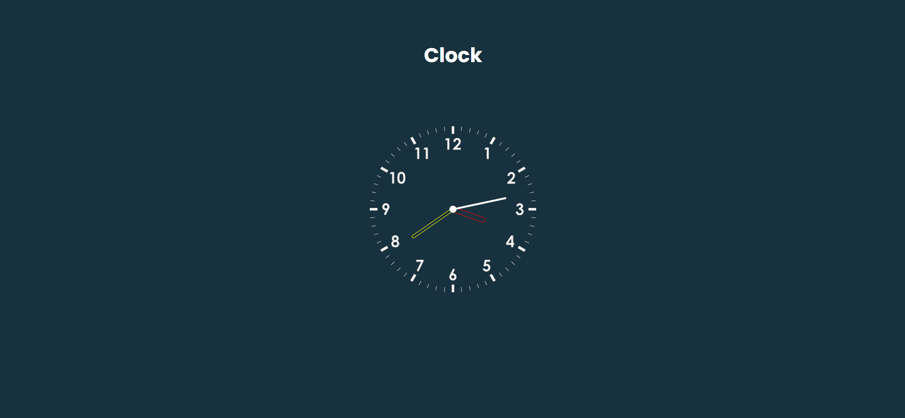

---

# Day 01 - Clock

A simple and elegant **analog clock** built using **HTML, CSS, and JavaScript**.  
This project displays the current time dynamically and updates in real-time.  

---

## 🚀 Features
- Real-time digital clock display
- Responsive design
- Lightweight and fast

---

## 🛠️ Tech Stack
- **HTML5** – structure  
- **CSS3** – styling and animations  
- **JavaScript (ES6)** – dynamic time updates  

---

## 📂 Project Structure
```bash
.
├── index.html        # Main HTML file
├── style.css         # Clock styling
└── script.js         # Clock logic
└── README.md         # README.md file

```
## How to run
1. Open `index.html` in any modern browser.  
2. Or run a local server and navigate to the `day-01` folder.  

## Screenshot

