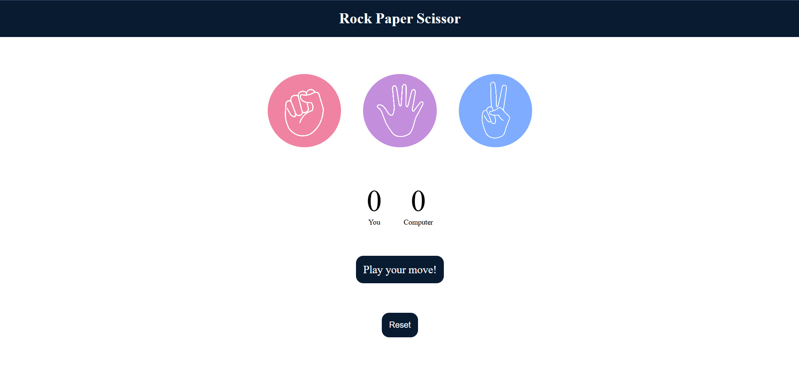

---

# Day 02 - To Do App

A simple and responsive **Todo App** built using **HTML, CSS, and JavaScript**.  
This app allows users to add, mark as complete, and delete tasks easily.  

---

## 🚀 Features
- Add new tasks
- Mark tasks as **completed**
- Delete tasks
- Data persistence with **local storage**
- Responsive and clean UI

---

## 🛠️ Tech Stack
- **HTML5** – structure  
- **CSS3** – styling and responsiveness  
- **JavaScript (ES6)** – functionality and logic  

---

## 📂 Project Structure
```bash
.
├── assests         # Assets for App
├── index.html        # Main HTML file
├── style.css         # App styling
├── script.js         # App logic
└── README.md         # README.md file
```

## How to run
1. Open `index.html` in any modern browser.  
2. Or run a local server and navigate to the `day-02` folder.  

## Screenshot
