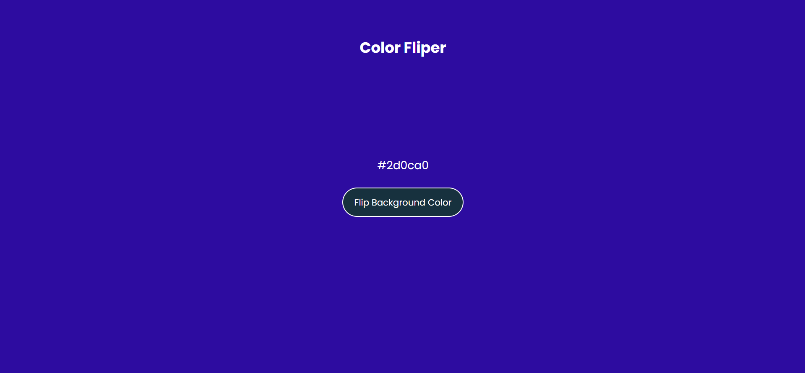

---

# Day 04 - Color Fliper

A fun and interactive **Color Fliper** built using **HTML, CSS, and JavaScript**.  
Try to generate different colors by clicking the button!

---

## 🚀 Features
- Click the button to generate a random color.  
- The background color of the page changes to the generated color.
- The hex code of the generated color is displayed on the screen.  
- Responsive design for various screen sizes.
- Smooth transition effect when the color changes.  

---

## 🛠️ Tech Stack
- **HTML5** – structure  
- **CSS3** – styling and responsiveness  
- **JavaScript (ES6)** – functionality and logic  

---

## 📂 Project Structure
```bash
.
├── assests           # Assets for App
├── index.html        # Main HTML file
├── style.css         # App styling
├── script.js         # App logic
└── README.md         # README.md file
```

## How to run
1. Open `index.html` in any modern browser.  
2. Or run a local server and navigate to the `day-03` folder.  

## Screenshot

