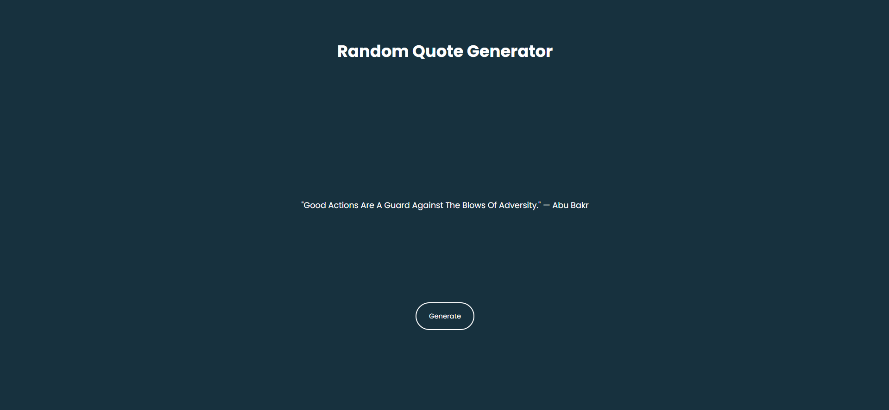

---

# Day 06 - Random Quote Generator

A fun and interactive **Palindrome Checker** built using **HTML, CSS, and JavaScript**.  
The app displays random motivational or inspirational quotes with the option to generate a new one at the click of a button. 

---

## 🚀 Features
- Generate a **new random quote** at the click of a button  
- Display **author names** along with quotes  
- Clean and responsive UI

---

## 🛠️ Tech Stack
- **HTML5** – structure  
- **CSS3** – styling and responsiveness  
- **JavaScript (ES6)** – functionality and logic  

---

## 📂 Project Structure
```bash
.
├── assests           # Assets for App
├── index.html        # Main HTML file
├── style.css         # App styling
├── script.js         # App logic
└── README.md         # README.md file
```

## How to run
1. Open `index.html` in any modern browser.  
2. Or run a local server and navigate to the `day-03` folder.  

## Screenshot

