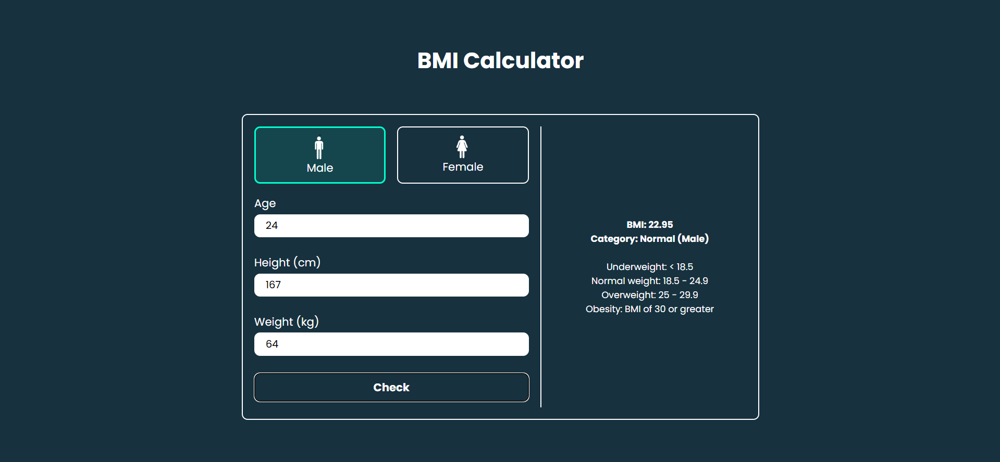

---

# Day 07 - BMI Calculator

A fun and interactive **BMI Calculator** built using **HTML, CSS, and JavaScript**.  
This app allows users to input their weight and height to calculate their Body Mass Index (BMI) and provides feedback on their health status.

---

## 🚀 Features
- **User Input**: Enter weight and height to calculate BMI.  
- **BMI Calculation**: Calculates BMI using the formula: `BMI = weight (kg) / (height (m) * height (m))`.  
- **Result Display**: Displays the calculated BMI along with a health category (Underweight, Normal weight, Overweight, Obesity).  
- **Responsive Design**: Works well on both desktop and mobile devices.

---

## 🛠️ Tech Stack
- **HTML5** – structure  
- **CSS3** – styling and responsiveness  
- **JavaScript (ES6)** – functionality and logic  

---

## 📂 Project Structure
```bash
.
├── assests           # Assets for App
├── index.html        # Main HTML file
├── style.css         # App styling
├── script.js         # App logic
└── README.md         # README.md file
```

## How to run
1. Open `index.html` in any modern browser.  
2. Or run a local server and navigate to the `day-03` folder.  

## Screenshot
