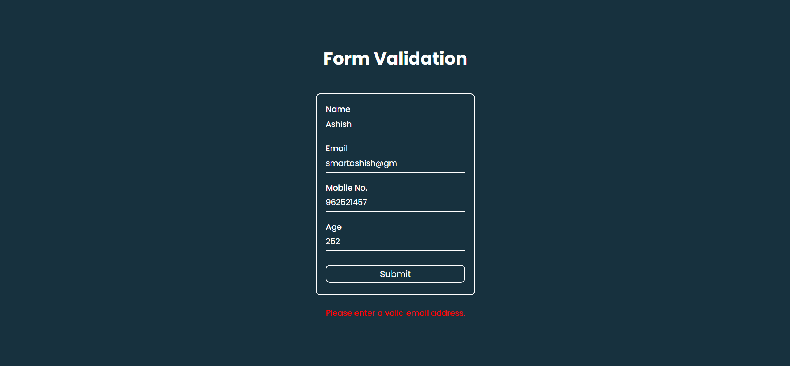

---

# Day 08 - Form Validation

A fun and interactive **Form Validation** built using **HTML, CSS, and JavaScript**.
This project demonstrates how to create a user-friendly form with real-time validation feedback, ensuring that users input data correctly before submission.

---

## 🚀 Features
- Real-time validation feedback
- User-friendly error messages
- Responsive design for various devices
- Clear and concise form layout
- Accessible and easy to use

---

## 🛠️ Tech Stack
- **HTML5** – structure  
- **CSS3** – styling and responsiveness  
- **JavaScript (ES6)** – functionality and logic  

---

## 📂 Project Structure
```bash
.
├── assests           # Assets for App
├── index.html        # Main HTML file
├── style.css         # App styling
├── script.js         # App logic
└── README.md         # README.md file
```

## How to run
1. Open `index.html` in any modern browser.  
2. Or run a local server and navigate to the `day-03` folder.  

## Screenshot
