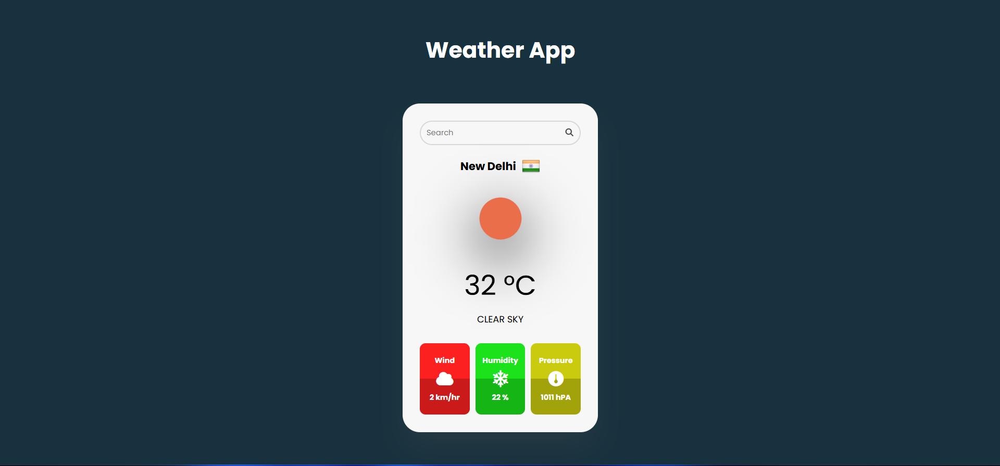

---

# Day 11 - Weather App

A simple and elegant **weather application** built using **HTML, CSS, and JavaScript**.

It fetches real-time weather data from a public API and displays it in a user-friendly interface.

---

## 🚀 Features
- Fetches real-time weather data from a public API
- Displays current temperature, humidity, and weather conditions
- Responsive design for all devices
- Lightweight and fast

---

## 🛠️ Tech Stack
- **HTML5** – structure  
- **CSS3** – styling and animations  
- **JavaScript (ES6)** – dynamic time updates  

---

## 📂 Project Structure
```bash
.
├── assets            # Assets for App
├── index.html        # Main HTML file
├── style.css         # Styling
├── script.js         # Logic
└── README.md         # README.md file

```
## How to run
1. Open `index.html` in any modern browser.  
2. Or run a local server and navigate to the `day-11` folder.  

## Screenshot

