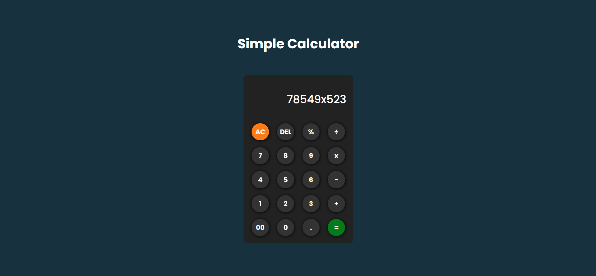

---

# Day 12 - Simple Calculator App

A simple calculator app built with HTML, CSS, and JavaScript.
It allows users to perform basic arithmetic operations like addition, subtraction, multiplication, and division. 

---

## 🚀 Features
- Perform addition, subtraction, multiplication, and division
- Clear input and reset calculator
- Responsive design for mobile and desktop
- User-friendly interface with buttons for digits and operations

---

## 🛠️ Tech Stack
- **HTML5** – structure  
- **CSS3** – styling and responsiveness  
- **JavaScript (ES6)** – functionality and logic  

---

## 📂 Project Structure
```bash
.
├── assests         # Assets for App
├── index.html        # Main HTML file
├── style.css         # App styling
├── script.js         # App logic
└── README.md         # README.md file
```

## How to run
1. Open `index.html` in any modern browser.  
2. Or run a local server and navigate to the `Day-12` folder.  

## Screenshot

