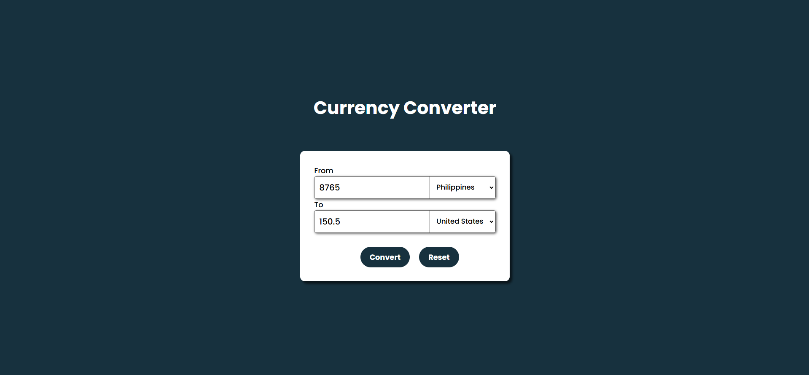

---

# Day 13 - Currency Converter App

A simple and intuitive Currency Converter App built with HTML, CSS, and JavaScript. 
This app allows users to convert amounts between different currencies using real-time exchange rates.  

---

## 🚀 Features
- Convert between multiple currencies
- Real-time exchange rates
- User-friendly interface
- Error handling for invalid inputs

---

## 🛠️ Tech Stack
- **HTML5** – structure  
- **CSS3** – styling and responsiveness  
- **JavaScript (ES6)** – functionality and logic  

---

## 📂 Project Structure
```bash
.
├── assests         # Assets for App
├── index.html        # Main HTML file
├── style.css         # App styling
├── script.js         # App logic
└── README.md         # README.md file
```

## How to run
1. Open `index.html` in any modern browser.  
2. Or run a local server and navigate to the `Day-13` folder.  

## Screenshot

