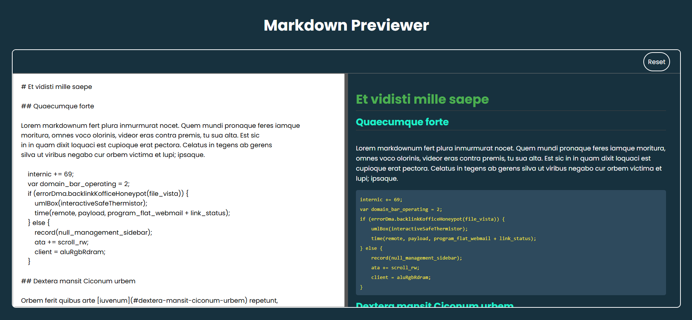

---

# Day 14 - Markdown Previewer

A simple and elegant **Markdown Previewer** built using **HTML, CSS, and JavaScript**.
This project allows users to convert Markdown text into formatted HTML in real-time.

---

## 🚀 Features
- Real-time Markdown to HTML conversion
- User-friendly interface
- Supports common Markdown syntax
- Live preview of formatted text

---

## 🛠️ Tech Stack
- **HTML5** – structure  
- **CSS3** – styling and animations  
- **JavaScript (ES6)** – dynamic time updates  

---

## 📂 Project Structure
```bash
.
├── assets            # Assets for App
├── index.html        # Main HTML file
├── style.css         # Styling
├── script.js         # Logic
└── README.md         # README.md file

```
## How to run
1. Open `index.html` in any modern browser.  
2. Or run a local server and navigate to the `day-14` folder.  

## Screenshot

