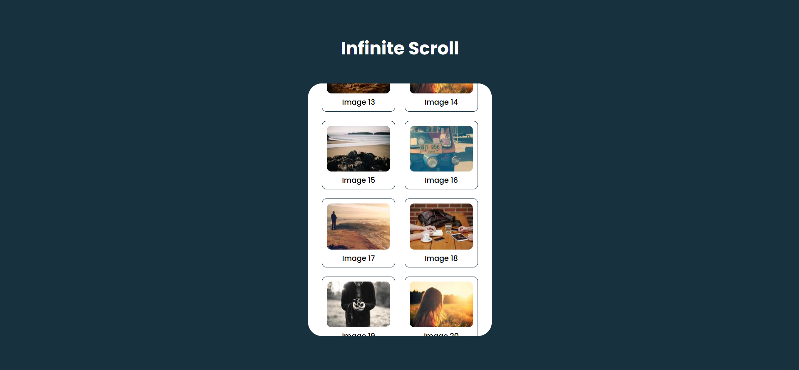

---

# Day 16 - Infinite Scroll

A simple **Infinite Scroll** implementation built using **HTML, CSS, and JavaScript**.
This project allows users to load more content as they scroll down the page.

---

## 🚀 Features
- Infinite scrolling functionality
- Smooth loading of new content
- Responsive design for various screen sizes
- Easy to customize and extend

---

## 🛠️ Tech Stack
- **HTML5** – structure  
- **CSS3** – styling and animations  
- **JavaScript (ES6)** – dynamic content loading  

---

## 📂 Project Structure
```bash
.
├── assets            # Assets for App
├── index.html        # Main HTML file
├── style.css         # Styling
├── script.js         # Infinite Scroll logic
└── README.md         # README.md file

```
## How to run
1. Open `index.html` in any modern browser.  
2. Or run a local server and navigate to the `day-16` folder.  

## Screenshot
