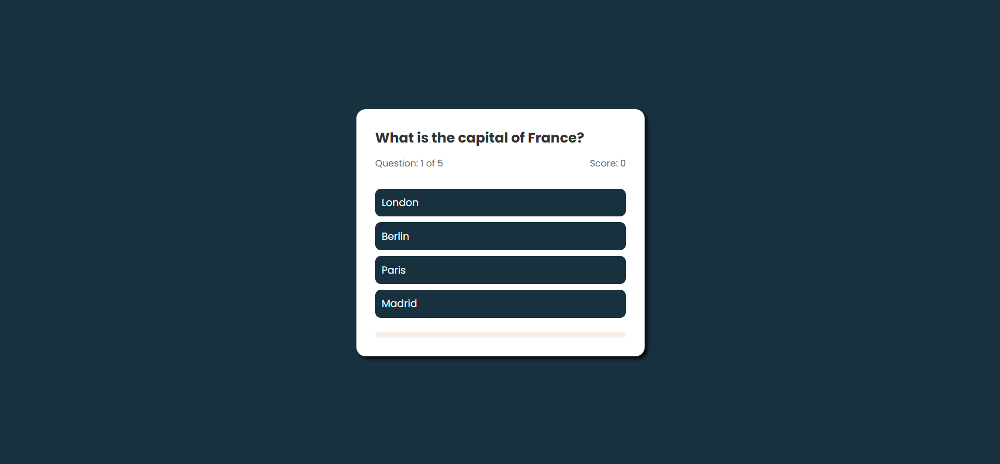

---

# Day 17 - Quiz App

A simple **Quiz App** implementation built using **HTML, CSS, and JavaScript**.
This project allows users to take a quiz and see their results.

---

## 🚀 Features
- Multiple choice questions
- Score tracking
- Responsive design
- Restart quiz option

---

## 🛠️ Tech Stack
- **HTML5** – structure  
- **CSS3** – styling and animations  
- **JavaScript (ES6)** – functionality  

---

## 📂 Project Structure
```bash
.
├── assets            # Assets for App
├── index.html        # Main HTML file
├── style.css         # Styling
├── script.js         # Logic
└── README.md         # README.md file

```
## How to run
1. Open `index.html` in any modern browser.  
2. Or run a local server and navigate to the `day-17` folder.  

## Screenshot
